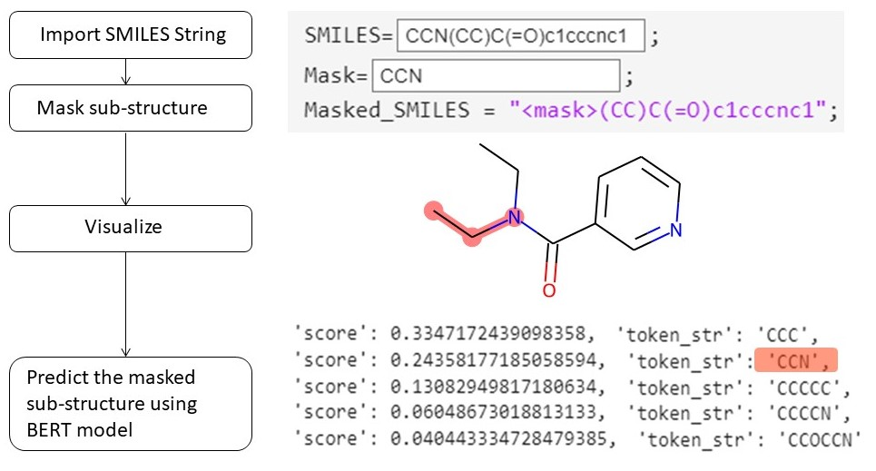

## Prediction of Masked SMILES Tokens Using BERT  
 

This example shows how to predict masked [SMILES](https://en.wikipedia.org/wiki/Simplified_molecular-input_line-entry_system) tokens using a pretrained [BERT](https://huggingface.co/transformers/v3.0.2/index.html) model [1]. BERT models are trained to perform various tasks. One of the tasks is known as masked language modeling which is the task of predicting token in text that have been replaced by a mask value. This example shows how to predict masked tokens for a given SMILES molecule and calculate the token probabilities using a pretrained BERT model. The image above shows the masked area of the molecule to be predicted.

### Usage

This example requires [DeepChem](https://deepchem.io/) [2], and [RDKit](https://www.rdkit.org/) [3]. Follow the instructions in the [MATLAB](https://matlab.mathworks.com/)® Live Script "Masked_SMILES_BERT_Prediction.mlx" to install Python requirements and to run the example.

Make sure to give the python address and to check versions of Python compatible with MATLAB products by release. This allows to build proper [MATLAB Interface to Python](https://www.mathworks.com/support/requirements/python-compatibility.html).

### Copyright

Copyright (c) 2024, The MathWorks, Inc.

### Reference

[1] [Transformers: State-of-the-Art Natural Language Processing](https://aclanthology.org/2020.emnlp-demos.6/).

[2] [MoleculeNet](https://arxiv.org/abs/1703.00564): A Benchmark for Molecular Machine Learning.

[3] [RDKit](http://www.rdkit.org): Open-source cheminformatics.

